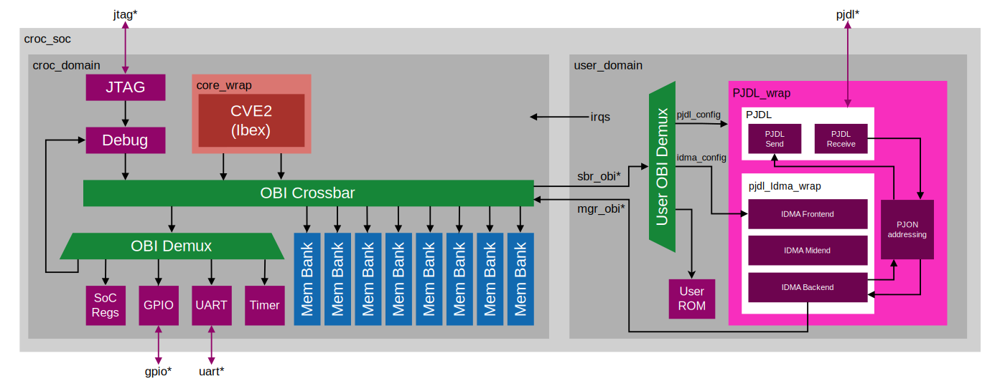

# PJON on CROC
This fork of the [CROC-Chip](https://github.com/pulp-platform/croc) integrates the [PJDL-HW](https://github.com/piussieber/PJON_HW)-module into the processor.\
The goal of the project was to show how a hardware implementation of [PJDL](https://github.com/gioblu/PJON/blob/master/src/strategies/SoftwareBitBang/specification/PJDL-specification-v5.0.md) helps to increase the processors efficiency by moving all the direct sending and receiving tasks from software to hardware.  PJDL is a single-wire data link protocol and belongs to the [PJON](https://github.com/gioblu/PJON) network protocol. With the implementation of all the receiving logic in hardware, packet loss is also minimized as the hardware can listen on the bus at all times, also when the CPU is busy doing other things.

This chip was designed as part of my bachelors project at [ETH Zurich](https://ethz.ch/de.html). It was therafter finalized for production in collaboration with Julian Lehmann as part of the VLSI design course at ETH Zurich.

This file only describes the changes made as part of the pjon on croc project. For more documentation about croc itself, please refer its repository: [CROC](https://github.com/pulp-platform/croc)

## Architecture
The main part of this project is the PJDL module. This module is the actual hardware implementation of the PJDL interface. The PJDL module is then integrated into the user space of Croc, inside a wrap together with the necessary additional modules. The whole implementation of Croc with the PJDL module in the user space can be seen in the following block schematic:

This block schematic should give a rough overview over the system. Not all connections and modules are shown, to make it easier to understand. Each element will be explained in more detail later on.

### PJDL-Module
This module implements the core functionality of the PJDL serial communication. The PJDL module consists of two different submodules, one for receiving and one for sending. They are interconnected such that only one of them is running at the time. This is done such that receiving the own data is prevented. The module also controls the following outputs and inputs:
`pjon_o`, `pjon_en_o`, `pjon_i`. Where `pjon_o` and `pjon_i` are the output and input ports of the PJDL. They can be combined to a single port. pjon_en_o indicates if the module wants to send data. For more in-depth documentation see the repository of the [PJDL-HW](https://github.com/piussieber/PJON_HW)-module.


(following: some important parts from the original croc documentation)

----------

## Requirements
We are using the excellent docker container maintained by Harald Pretl. If you get stuck with installing the tools, we urge you to check the [Tool Repository](https://github.com/iic-jku/IIC-OSIC-TOOLS).  
The current supported version is 2025.03, no other version is officially supported.

### ETHZ systems
ETHZ Design Center maintains an internal version of the IHP PDK, with integrations into all tools we have access to. For this reason if you work on the ETH systems it is recommended to use the `icdesign` tool (cockpit) instead of the liked Github repo.  
You can directly create a cockpit directory inside the croc directory:
```sh
# Make sure you are in <somedir>/croc
# the checked-out repository
icdesign ihp13 -nogui
```
The setup is guided by the `.cockpitrc` configuration file. If you need different macros or another version of the standard cells you can change it accordingly.

An environment setup for bash is provided to get easy access to the tools:
```sh
source ethz.env
```

Additionally you may prefer to just enter a shell in the pre-installed osic-tools container using:
```sh
oseda bash
# older version eg: oseda -2025.03 bash
```

### Other systems
**Note: this has currently only been tested on Ubuntu and RHEL Linux.**

#### Docker (easy) 
There are two possible ways, the easiest way is to install docker and work in the docker container, you can follow the install guides on the [Docker Website](https://docs.docker.com/desktop/).  
You do not need to manually download the container image, this will be done when running the script.
If you do not have `git` installed on your system, you also need to install [Github Desktop](https://desktop.github.com/download/) and then clone this git repository.  

It is a good idea to grant non-root (`sudo`) users access to docker, this is decribed in the [Docker Article](https://docs.docker.com/engine/install/linux-postinstall/#manage-docker-as-a-non-root-user).

Finally, you can navigate to this directory, open a terminal (PowerShell in Windows) and type:
```sh
# Linux only (starts and enters docker container in shell)
./start_linux.sh
# Linux/Mac (starts VNC server on localhost:5901)
./start_vnc.sh
# Windows (starts VNC server on localhost:5901)
./start_vnc.bat
```

If you use the VNC option, open a browser and type `localhost` in the address bar. 
This should connect you to the VNC server, the password is `abc123`, then test by right-clicking somewhere, starting the terminal and typing `ls`.  
You should see the files in this repository again.

Now you should be in an Ubuntu environment with all tools pre-installed for you.  
If something does not work, refer to the upstream [IIC-OSIC-Tools](https://github.com/iic-jku/IIC-OSIC-TOOLS/tree/main)

#### Native install (hard)
You need to build/install the required tools manually:

- [Bender](https://github.com/pulp-platform/bender#installation): Dependency manager
- [Yosys](https://github.com/YosysHQ/yosys#building-from-source): Synthesis tool
- [Yosys-Slang](https://github.com/povik/yosys-slang): SystemVerilog frontend for Yosys
- [OpenRoad](https://github.com/The-OpenROAD-Project/OpenROAD/blob/master/docs/user/Build.md): Place & Route tool
- (Optional) [Verilator](https://github.com/verilator/verilator): Simulator
- (Optional) Questasim/Modelsim: Simulator


## Getting started
The SoC is fully functional as-is and a simple software example is provided for simulation.
To run the synthesis and place & route flow execute:
```sh
make checkout
make yosys
make openroad
make klayout
```

To simulate you can use:
```sh
make verilator
```

If you have Questasim/Modelsim, you can also run:
```sh
make vsim
```


The most important make targets are documented, you can list them with:
```sh
make help
```

## Bender
The dependency manager [Bender](https://github.com/pulp-platform/bender) is used in most pulp-platform IPs.
Usually each dependency would be in a seperate repository, each with a `Bender.yml` file to describe where the RTL files are, how you can use this dependency and which additional dependency it has.
In the top level repository (like this SoC) you also have a `Bender.yml` file but you will commonly find a `Bender.lock` file. It contains the resolved tree of dependencies with specific commits for each. Whenever you run a command using Bender, this is the file it uses to figure out where things are.

Below is a small guide aimed at the usecase for this project. The Bender repo has a more extensive [Command Guide](https://github.com/pulp-platform/bender?tab=readme-ov-file#commands).

### Checkout
Using the command `bender checkout` Bender will check the lock file and download the specified commits from the repositories (usually into a hidden `.bender` directory). 

### Update
Running `bender update` on the other hand will resolve the entire tree again and re-generate the lock file (you usually have to resolve some version/revision conflicts if multiple things use the same dependency).

**Remember:** always test everything again if you generate a new `Bender.lock`, it is the same as modifying RTL.

### Local Versions
For this repository, we use a subcommand called `bendor vendor` together with the `vendor_package` section in `Bender.yml`.
`bendor vendor` can be used to Benderize arbitrary repositories with RTL in it. The dependencies are already 'checked out' into `rtl/<IP>`. Each file or directory from the repository is mapped to a local path in this repo.
Fixes and changes to each IPs `rtl/<IP>/Bender.yml` are managed by `bender vendor` in `rtl/patches`.

If you need to update a dependency or map another file you need to edit the coresponding `vendor_package` section in `Bender.yml` and then run `bender vendor init`. Then you might need to change `rtl/<IP>/Bender.yml` to list your new file in the sources. 
To save a fix/change as a patch, stage it in git and then run `bender vendor patch`. When prompted, add a commit message (this is used as the patches file name). Finally, commit both the patch file and the new `rtl/<IP>`.

**Note:** using `bender vendor` in this repository to change the local versions of the IPs requires an up-to-date version of Bender, specifically it needs to include [PR 179](https://github.com/pulp-platform/bender/pull/179).

### Targets
Another thing we use are targets (in the `Bender.yml`), together they build different views/contexts of your RTL. For example without defining any targets the technology independent cells/memories are used (in `rtl/tech_cells_generic/`) but if we use the target `ihp13` then the same modules contain a technology-specific implementation (in `ihp13/`). Similar contexts are built for different simulators and other things.

## License
Unless specified otherwise in the respective file headers, all code checked into this repository is made available under a permissive license. All hardware sources and tool scripts are licensed under the Solderpad Hardware License 0.51 (see `LICENSE.md`). All software sources are licensed under Apache 2.0.
