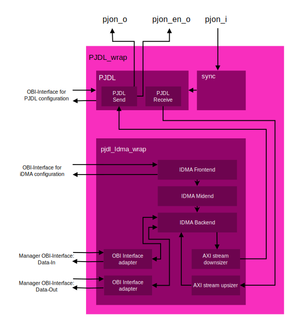

# PJON on CROC
This fork of the [CROC-Chip](https://github.com/pulp-platform/croc) integrates the [PJDL-module](https://github.com/piussieber/PJON_HW) into the processor.\
The goal of the project was to show how a hardware implementation of [PJDL](https://github.com/gioblu/PJON/blob/master/src/strategies/SoftwareBitBang/specification/PJDL-specification-v5.0.md) helps to increase the processors efficiency by moving all the direct sending and receiving tasks from software to hardware.  PJDL is a single-wire data link protocol and belongs to the [PJON](https://github.com/gioblu/PJON) network protocol. With the implementation of all the receiving logic in hardware, packet loss is also minimized as the hardware can listen on the bus at all times, also when the CPU is busy doing other things.

This chip was designed as part of my bachelors project at [ETH Zurich](https://ethz.ch/de.html). It was therafter finalized for production in collaboration with Julian Lehmann as part of the VLSI design course at ETH Zurich.

This file only describes the changes made as part of the pjon on croc project. For more documentation about croc itself, please refer its repository: [CROC](https://github.com/pulp-platform/croc)

## Architecture
The main part of this project is the PJDL module. This module is the actual hardware implementation of the PJDL interface. The PJDL module is then integrated into the user space of Croc, inside a wrap together with the necessary additional modules. The whole implementation of Croc with the PJDL module in the user space can be seen in the following block schematic:\
\
This block schematic should give a rough overview over the system. Not all connections and modules are shown, to make it easier to understand. Each element will be explained in more detail later on.

### PJDL-Module
This module implements the core functionality of the PJDL serial communication. The PJDL module consists of two different submodules, one for receiving and one for sending. They are interconnected such that only one of them is running at the time. This is done such that receiving the own data is prevented. The module also controls the following outputs and inputs:
`pjon_o`, `pjon_en_o`, `pjon_i`. Where `pjon_o` and `pjon_i` are the output and input ports of the PJDL. They can be combined to a single port. pjon_en_o indicates if the module wants to send data. For more in-depth documentation see the repository of the [PJON-HW](https://github.com/piussieber/PJON_HW) repository.

### PJON-Addressing
The purpose of the PJON-Addressing module is to filter out data that is not meant for the current device. In PJON networks with a lot of devices this can increase the performance significantly.\
This module is also part of the PJON-HW repository and its documentation can also be found [there](https://github.com/piussieber/PJON_HW#pjon-addressing). 

### PJDL-wrap
The PJDL wrap is the main wrapper around all modules belonging to the PJDL module. It connects the iDAM wrapper to the PJDL module and leads all signals needed by the iDMA wrapper to the outside. The following image gives an overview over the PJDL-wrap:\
\
To allow the PJDL module to be controlled from the processor, this wrapper contains some registers as well, which can be address with addresses starting from 0x20001000. All registers available are listed in the following table:

| Address | Size     | Name                         | Access        |
|---------|----------|------------------------------|---------------|
| 0x00    | 1 bit    | activate DMA receiving       | Read & Write  |
| 0x01    | 20 bits  | pjdl preamble length         | Read & Write  |
| 0x02    | 14 bits  | pjdl pad length              | Read & Write  |
| 0x03    | 12 bit   | pjdl data length             | Read & Write  |
| 0x04    | 12 bits  | pjdl acceptance length       | Read & Write  |
| 0x05    | 1 bit    | pjdl activate module         | Read & Write  |
| 0x06    | 11 bits  | axi stream interface         | Read & Write  |
| 0x07    | 4 bits   | status register              | Read          |

In the following the different options are described a bit more in detail.

Writing data to the "AXI-stream interface"-register, sends the data directly to the PJDL module, as soon as the PJDL-module isn't busy because of an iDMA transfer going on. With bit 8 of that register, the `TLAST`-bit of the AXI stream interface can be set. Bit 9 and 10 are assigned to the `TUSER`-bits of the AXI stream interface and allow to send acknowledgments as well as acknowledgment-requests. These special commands are not usable through iDMA.

Reading from the same register, reads the the data from the PJDL interface directly. This functionality is active as long as the bit in the  first register "activate DMA receiving" is not set. Otherwise all data is sent to the DMA.

With register 5 it is possible to enable and disable the whole PJDL module to save energy if it is not used.

The last register called "status register" contains information about the sending and receiving process. Bit 0 is one if the AXI-stream interface register (0x06) is ready to receive new data. Bit 1 is set to one if there is new data received and ready to be read from the AXI-stream interface register (0x06). Bit 3 is the "sending\_in\_progress\_o" signal from the PJDL module as described it's documentation, while bit 2 is the "receving\_in\_progress\_o" signal.

### iDMA
The [iDMA](https://github.com/pulp-platform/iDMA) module is built out of three main sub modules according to the iDMA documentation. The whole structure can be seen in the figure above in the PJDL-wrap section. Each block is explained in more detail in the following subsections.

#### Backend
The backend is the part of the iDMA, that does the actual transfer of the data. It is completely auto-generated by the scripts provided in the [iDMA repository](https://github.com/pulp-platform/iDMA). In our case it has four data interfaces. Two of them are OBI-Interfaces, one for each direction. The other two are AXI-stream interfaces, also in both directions.\
The backend accepts simple 1-D requests at its input. These consist of a source, a destination, a length and some options.

#### Midend
The midend used in this project was designed and written specifically for this project.

The selection of the interface where the backend has to copy from and to is specified with the options of the 1-D request. This however is not ideal in our case, as we would need to be able to chose this additional option from the processor. It is much easier to assign one address in the memory space to the AXI-stream interface. As soon as anything is written from or tho this location, the iDMA switches its source or destination to the AXI-stream interface. This conversion of one address to the option selection is one task of the midend.

The other thing the backend doesn't support on its own is the use of the `TLAST` signal of the AXI-stream interface. The backend always expects a length as part of its 1-D request, and thereafter copies the amount given in the request. For our purpose this isn't ideal, as the PJDL module should be able to end the transfer, if the transmission stops. To solve this issue, the midend splits the transfers always into multiple transfers of length one, when it wants the backend to read from the AXI-stream interface. It then stops the transfers as soon as the last bit on the AXI-stream interface is set or if the given transfer length is reached.

The input of the midend is again a 1-D request with source, destination legnth and options, same as the backend.

#### Frontend
The frontend creates the connection between the processor and the rest of the iDMA. For this purpose the iDMA repository provides multiple options to control the iDMA by a register interface. There is also a frontend for simple 1-D transfers. Still the register interface isn't directly connectable to OBI and an other interface adapter would be needed. Also, the frontends available in the repository include an option to create a whole list of DMA-transfers, which should be done one after the other. This is not needed for this project tough and it would make the configuration of the iDMA quite a bit more difficult.

For simplicity it was decided, to write a much simpler frontend specifically for this project. Our fontend connects an OBI-interface directly to some simple configuration registers, which thereafter create the 1-D request.

#### Frontend registers
In following table the different registers are noted with their specific use case. The address has to be added to the base address of the OBI frontend, which is in our case set to 0x20002000:

| Address | Size    | Name                                  | Access        |
| ------- | ------- | ------------------------------------- | ------------- |
| 0x01    | 32 bits | transfer size & start                 | Read & Write  |
| 0x02    | 32 bits | source address                        | Read & Write  |
| 0x03    | 32 bits | destination address                   | Read & Write  |
| 0x04    | 1 bit   | command forwarded                     | Read          |
| 0x05    | 8 bits  | busy status of the backend            | Read          |
| 0x06    | 1 bits  | transfer done                         | Read          |

To start a transfer the source and destination address registers have to be set. As soon as the length is set, the transfer starts. As soon as the transfer starts, the "command forwarded" bit is set. While the transfer is ongoing, the status can be read from the busy status register. This register contains the status information coming directly from the backend.

After the start of the transfer, the most important register is the "transfer done" register, which becomes one as soon as the DMA transfer is completed.

#### Additional Modules within the iDMA wrap
Apart from our three main iDMA Modules, there are four additional modules located within the iDMA-wrap. Two of them are simple interface adapters needed for the manager obi interface, as the obi-interface types used by the backend are not the same as the one used by the rest of Croc. The other two modules are up- and downsizer for the AXI stream. They are needed as our obi interface has a width of 32bits. To make transfers as efficient as possible, the iDMA module copies 32bits at a time, which thereafter have to be resized to be connected to the PJDL module.

